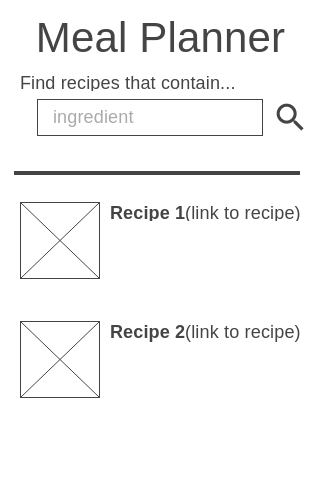
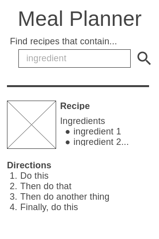
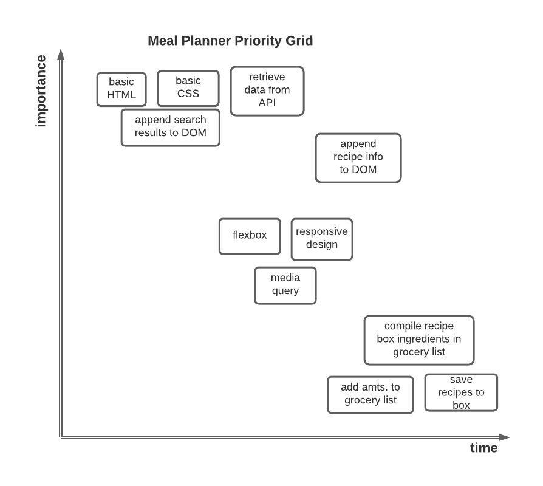

# Project Overview

## Meal Planner

[Your deployed site] ("url in strings")

## Project Description

The meal planner application enables a user to look up recipes based on the ingredients they have using the TheMealDB API. The search results will include links to the full recipes, with an ingredient list and directions. Recipes can be saved and viewed in the "saved recipes" section.

## API and Data Sample

Here is a link for [Honey Teriyaki Salmon](https://www.themealdb.com/api/json/v1/1/search.php?s=honey%20teriyaki%20salmon)
```{
    "meals": [
        {
            "idMeal": "52773",
            "strMeal": "Honey Teriyaki Salmon",
            "strDrinkAlternate": null,
            "strCategory": "Seafood",
            "strArea": "Japanese",
            "strInstructions": "Mix all the ingredients in the Honey Teriyaki Glaze together. Whisk to blend well. Combine the salmon and the Glaze together.\r\n\r\nHeat up a skillet on medium-low heat. Add the oil, Pan-fry the salmon on both sides until it’s completely cooked inside and the glaze thickens.\r\n\r\nGarnish with sesame and serve immediately.",
            "strMealThumb": "https://www.themealdb.com/images/media/meals/xxyupu1468262513.jpg",
            "strTags": "Fish,Breakfast,DateNight",
            "strYoutube": "https://www.youtube.com/watch?v=4MpYuaJsvRw",
            "strIngredient1": "Salmon",
            "strIngredient2": "Olive oil",
            "strIngredient3": "Soy Sauce",
            "strIngredient4": "Sake",
            "strIngredient5": "Sesame Seed",
            "strIngredient6": "",
            "strIngredient7": "",
            "strIngredient8": "",
            "strIngredient9": "",
            "strIngredient10": "",
            "strIngredient11": "",
            "strIngredient12": "",
            "strIngredient13": "",
            "strIngredient14": "",
            "strIngredient15": "",
            "strIngredient16": null,
            "strIngredient17": null,
            "strIngredient18": null,
            "strIngredient19": null,
            "strIngredient20": null,
            "strMeasure1": "1 lb",
            "strMeasure2": "1 tablespoon",
            "strMeasure3": "2 tablespoons",
            "strMeasure4": "2 tablespoons",
            "strMeasure5": "4 tablespoons",
            "strMeasure6": "",
            "strMeasure7": "",
            "strMeasure8": "",
            "strMeasure9": "",
            "strMeasure10": "",
            "strMeasure11": "",
            "strMeasure12": "",
            "strMeasure13": "",
            "strMeasure14": "",
            "strMeasure15": "",
            "strMeasure16": null,
            "strMeasure17": null,
            "strMeasure18": null,
            "strMeasure19": null,
            "strMeasure20": null,
            "strSource": null,
            "dateModified": null
        }
    ]
}
```
## Wireframes

This is what the search results will look like<br />
<br />
This is what the recipe view will look like<br />
<br />

### MVP/PostMVP

#### MVP 

- Use Axios to make a request to TheMealDB API
- Insert information on ingredients, dishes, photos, and directions to the DOM
- Render search results for a specific ingredient on page
- Make functioning links for dishes that pull up a recipe 
- Style using Flexbox
- Implement responsive design (mobile-first design)
- Use a media query/breakpoint for desktop screens

#### PostMVP  

- Add a save recipe button to collect recipes in a recipe box via window.localStorage (.setItem)
- Aggregate ingredients from saved recipes into a master grocery list
- Include quantities of ingredients needed on master grocery list

## Project Schedule

|  Day | Deliverable | Status
|---|---| ---|
|Feb 22-23| Prompt / Wireframes / Priority Matrix / Timeframes | Complete
|Feb 23| Project Approval | Complete
|Feb 23-4| Core Application Structure HTML / app.js | Complete
|Feb 24| Initial Clickable Model | Complete
|Feb 25| MVP | Complete
|Feb 26| Styling | Complete
|March 1| Presentations | Incomplete

## Priority Matrix



## Timeframes

| Component | Priority | Estimated Time | Time Invested | Actual Time |
| --- | :---: |  :---: | :---: | :---: |
| Creating Basic HTML Template | H | 1 hr | 1 hr | 1 hr |
| Understanding API | H | 2 hrs | 2 hrs | 2 hrs |
| Create click event for search bar info | H | 1 hr | .5 hrs | .5 hrs |
| Render recipe results to page via DOM | H | 2 hrs | .5 hrs | .5 hrs |
| Create remove results function | H | 1 hrs | .5 hrs | .5 hrs |
| Append specific recipe info to page via DOM | H | 2 hrs | 3 hrs | 3 hrs |
| Click event load specific recipe | H | 2 hrs | 2 hrs | 2 hrs |
| Format photos appended to DOM | H | 1 hr | 1 hr |  |
| Flexbox for index page | H | 2 hrs | 2 hrs |  |
| Flexbox for search results | H | 3 hrs | 1.5 hrs |  |
| Flexbox for individual recipes | H | 2 hrs | 1 hr |  |
| CSS color and font styling | H | 1 hr | 2 hrs |  |
| Add icons to buttons | H | 1.5 hrs | 1 hr |  |
| *ADDED* Stylize the "no results" option | H | 1 hr | .5 hrs |  |
| *ADDED* Make click events more noticeable with styling | H | 1.5 hrs | .5 hrs |  |
| Media query for desktop - index | H | 2 hrs | 2 hrs |  |
| Media query for desktop - search | H | 2 hrs | 2.5 hrs |  |
| Media query for desktop - recipe | H | 2 hrs | 2.5 hrs |  |
| Create a "save recipes" function | H | 3hrs| 3 hrs |  |
| Display saved recipes in recipe-box page | H | 2 hrs | 2 hrs |  |
| ~~Compile saved recipes' ingredients to grocery list~~ | ~~H~~ | ~~3 hrs~~ |  |  |
| ~~Add amounts to grocery list~~ | ~~H~~ | ~~3 hrs~~ |  |  |
| *ADDED* Stylize the heading - maybe an icon? | H | 1.5 hrs | 1.5 hrs |  |
| Organize final CSS | H | 1 hr | 2 hrs |  |
| *ADDED* Cleaning up code | H | 1.5 hrs | 3 hrs |  |
| *ADDED* Display number of search results | H | 1.5 hrs | 1 hr |  |
| Total | H | 43 hrs| 37 hrs |  |

## Code Snippet

For this assignment, I had to figure out how to match up the ingredients with their amounts and append all of it to a table. All of this information was stored in an object as key/value pairs. I used a for... in loop to find the ingredients and amounts, append them to their respective arrays, and then align those two arrays into rows of a table that was appended to the DOM:

```
  for (let key in obj) {
    // This reference showed me how to check if a string contains a substring: https://flaviocopes.com/how-to-string-contains-substring-javascript/
    if (key.includes("strMeasure") && (obj[key] != " " || obj[key] != "")) {
      measurements.push(obj[key])
    }
  }
  for (let key in obj) {
    if (key.includes("strIngredient") && (obj[key] != "" || obj[key] != " ")) {
      ingredients.push(obj[key])
    }
  }

  // Fill in the table with measurement and ingredient arrays
  for (let i = 0; i < measurements.length; i++) {
    let row = ingredientTable.insertRow(i)
    let cell1 = row.insertCell(0)
    let cell2 = row.insertCell(1)
    cell1.textContent = measurements[i]
    cell2.textContent = ingredients[i]
  }
```

## Change Log
I decided not to pursue the post-MVP goal of creating a grocery list because the ingredients and their measurements are not standardized in the database.

I spent a lot of time cleaning up the code at the end.

I tried to create a helper function that added attributes to images, but it created a lot of formatting problems, so I abandoned the idea.
